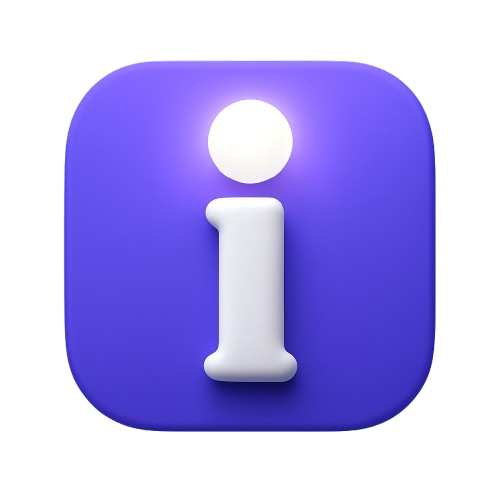
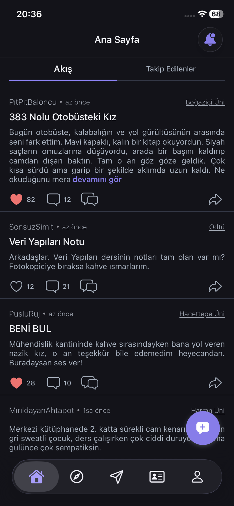
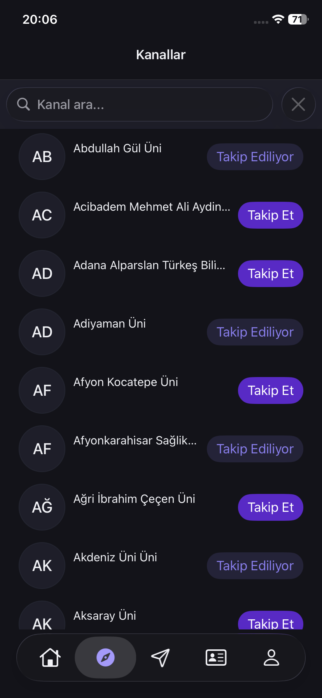
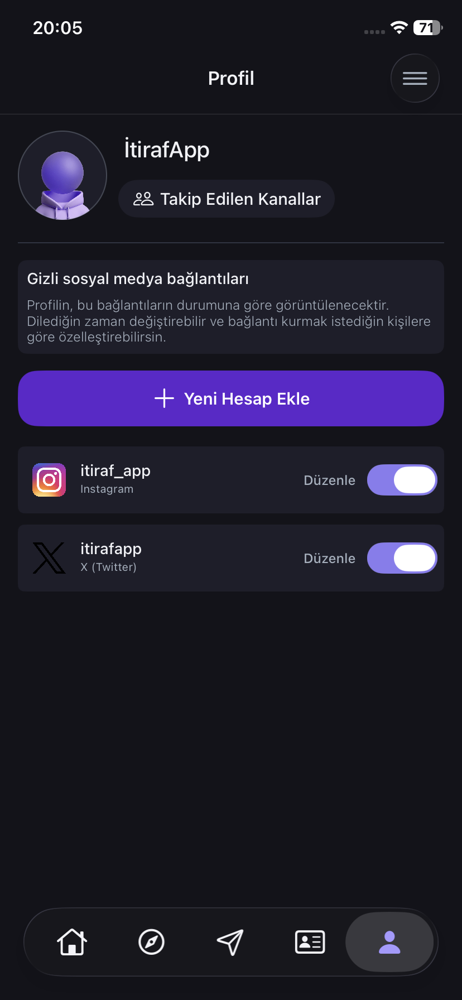

<h1 align="center">
   
  
   
  itirafApp
   
</h1>

<h4 align="center">İnsanların içindekileri anonim ve özgürce dökebildiği, eğlenceli ve güvenli iOS itiraf platformu 🎭</h4>

  
  
  
  

  
  &nbsp;
  

  <a href="#-proje-hakkında">Hakkında</a> •
  <a href="#-ekran-görüntüleri">Ekran Görüntüleri</a> •
  <a href="#-i̇ndir">İndir</a> •
  <a href="#-öne-çıkan-özellikler">Özellikler</a> •
  <a href="#-kullanılan-teknolojiler">Teknolojiler</a> •
  <a href="#-geliştirici">Geliştirici</a>

---

## 📖 Proje Hakkında

**itirafApp**, kullanıcıların kimliklerini tamamen gizli tutarak içlerindeki sırları, komik anılarını veya dertlerini paylaşabilecekleri bir anonim sosyal ağ uygulamasıdır.

%100 Swift ile geliştirilmiş olup, UIKit tabanlı modern iOS tasarım standartlarına uygun, akıcı ve kullanıcı dostu bir arayüze sahiptir. Kullanıcılar yalnızca kendi seçtikleri anonim kimliklerle etkileşime girer, böylece gerçek dünyadan bağımsız ve özgür bir paylaşım ortamı oluşur.

## 📱 Ekran Görüntüleri

  
  &nbsp;&nbsp;
  
  &nbsp;&nbsp;
  
  &nbsp;&nbsp;
  

## 📥 İndir

  
  &nbsp;
  

## ✨ Öne Çıkan Özellikler

| Özellik | Açıklama |
|---------|----------|
| 🎭 **Anonim Paylaşım** | Kullanıcılar tamamen anonim kalarak itiraflarını özgürce yazabilirler |
| 📬 **Anlık Bildirimler** | Push Notifications ile yeni mesajlar, beğeniler ve güncellemelerden anında haberdar olma |
| 💬 **Mesajlaşma** | Anonim kullanıcılar arasında güvenli mesaj gönderme ve alma sistemi |
| 📢 **Kanal Sistemi** | Farklı konularda organize edilmiş kanallar aracılığıyla itirafları keşfetme |
| 🔔 **Bildirim Yönetimi** | Özelleştirilebilir bildirim tercihleri ile tam kontrol |
| 🛡️ **Moderasyon** | İçerik güvenliğini sağlamak için gelişmiş raporlama ve moderasyon altyapısı |
| 🎨 **Modern Arayüz** | Göz yormayan, akıcı ve kullanıcı dostu UI/UX tasarımı |
| 🚀 **Onboarding** | Yeni kullanıcılar için adım adım tanıtım ekranları |
| 🌗 **Dark / Light Tema** | Kullanıcı tercihine göre karanlık ve aydınlık tema desteği |
| 🌍 **Çoklu Dil Desteği** | Türkçe ve İngilizce dil desteği |
| 🔐 **Sosyal Giriş** | Google ve Apple ile hızlı ve güvenli oturum açma |

## 🛠 Kullanılan Teknolojiler

| Kategori | Teknoloji |
|----------|-----------|
| **Dil** | Swift 5.0 |
| **Arayüz** | UIKit |
| **Mimari Desen** | MVVM + Coordinator Pattern |
| **Backend İletişimi** | REST API |
| **Gerçek Zamanlı İletişim** | WebSocket |
| **Hata Takibi** | Firebase Crashlytics |
| **Kullanıcı Analizi** | Microsoft Clarity |
| **Bildirimler** | Apple Push Notification Service (APNs) |
| **Tema** | Dark / Light Mode |
| **Lokalizasyon** | Multi-Language (TR, EN) |
| **Kimlik Doğrulama** | Google Sign-In, Sign in with Apple |

## 👨‍💻 Geliştirici

- **GitHub:** [@EmreYlr](https://github.com/EmreYlr)
- **LinkedIn:** [Emre Can Yeler](https://www.linkedin.com/in/emrecanyeler/)

